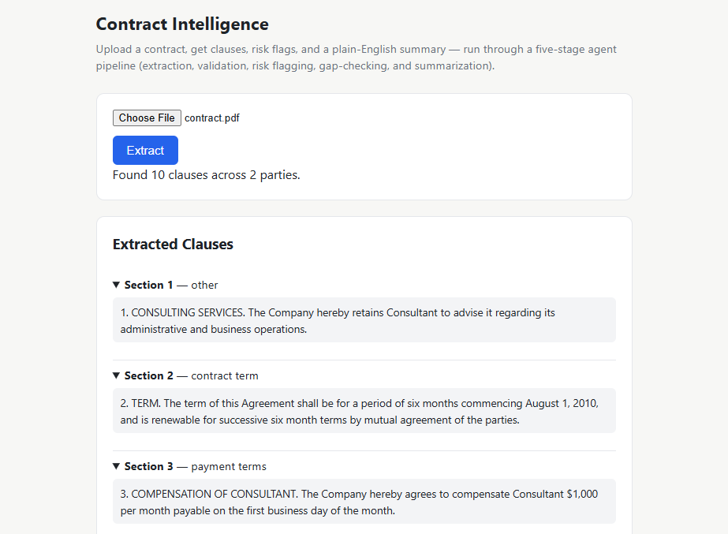
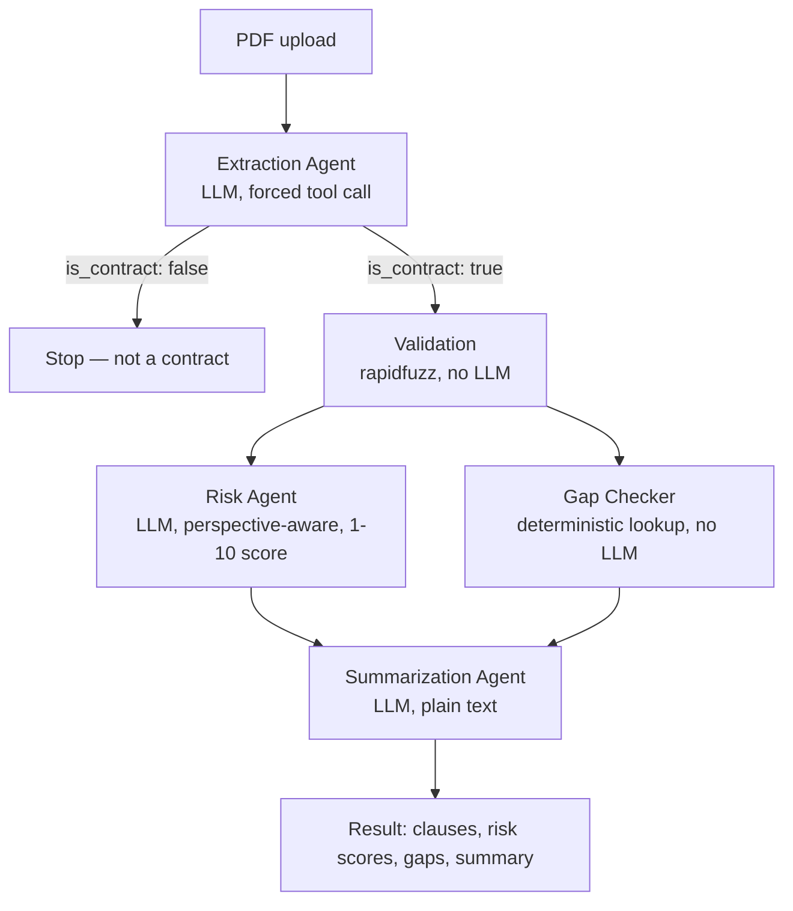

# Contract Intelligence Platform

Upload a contract and get its clauses extracted, checked for risks, checked for missing clauses, and summarized in plain English.

The system uses a five-stage pipeline:

Extraction -> Validation -> Risk Analysis -> Gap Check -> Summarization



**[Live demo](https://contract-intelligence-platform-eauj.onrender.com)** · Python (FastAPI) backend, vanilla HTML/CSS/JS frontend, built from scratch with no LangChain / LlamaIndex.

> The app is hosted on a free tier, so the first request after some inactivity can take up to a minute while the server starts. Uploads are limited to 5 per hour and 10 MB. Please use a sample contract, not a real confidential document. The text is sent to an AI model for analysis and is not stored. This is a portfolio project, not a compliance tool.

---

## What it does

Upload a contract PDF, and the app:

1. Detects whether the document is a contract, identifies its type, and finds all parties.
2. Extracts the clauses and classifies them using a 19-type clause taxonomy.
3. Checks that every extracted clause actually appears in the original document.
4. Lets you choose which party you represent, then gives each clause a 1–10 risk score from that party's perspective.
5. Finds clause types that are normally expected for that type of contract but are missing.
6. Creates a plain-English summary that a non-lawyer can understand.

## Architecture



The system has five main stages:

- Extraction — Uses an LLM to identify the contract, parties, and clauses.
- Validation — Uses Python and rapidfuzz to check that the extracted clauses exist in the source text.
- Risk Flagging — Uses an LLM to score each clause from the selected party's perspective.
- Gap Checking — Uses a fixed lookup table to find expected but missing clause types.
- Summarization — Uses an LLM to create a plain-English summary.

## Design decisions worth noting

- **No RAG.** The full contract is sent directly to the extraction agent instead of using RAG. Contracts are usually short enough that splitting them into chunks and retrieving them later was not worth the extra complexity or possible loss of context.
- **Structured output only where it matters.** Extraction and risk analysis use forced tool calls, so the model always returns structured JSON. Summarization uses normal text generation because its output is meant to be prose. Forcing a summary into a JSON schema would make the output less natural.
- **Deterministic where possible.** Clause validation and the missing-clause check are handled with normal Python code instead of an LLM. This makes them cheaper, faster, more predictable, and less likely to hallucinate. For example, the validation step checks whether an extracted clause actually exists in the original contract instead of simply trusting the model.
- **Risk is directional.** Risk is not the same for both sides of a contract. For example, a liability clause might be low-risk for the party that wrote it but high-risk for the other party. The risk agent is therefore told which party it is protecting and scores each clause from 1–10 using a fixed scoring guide. This helps avoid vague scores that simply cluster around the middle.

## Tech stack

- **Backend:** FastAPI (Python), Gemini 3.6-flash via Gemini's OpenAI-compatible endpoint
- **Frontend:** Vanilla HTML/CSS/JS — no framework
- **Validation:** rapidfuzz (fuzzy string matching, no LLM)
- **PDF parsing:** pypdf
- **Deployment:** Docker, hosted on Render

## Running it locally

```bash
git clone https://github.com/msarkar2501/Contract-Intelligence-Platform.git
cd Contract-Intelligence-Platform
python -m venv venv
venv\Scripts\Activate          # Windows PowerShell
# source venv/bin/activate     # macOS/Linux
pip install -r requirements.txt
```

Create a `.env` file in the project root:
```
GEMINI_API_KEY=your_key_here
```

Run the backend:
```bash
uvicorn main:app --reload
```

Open and edit `index.html` to point at `http://localhost:8000`.

## Running it with Docker

```bash
docker build -t contract-intel-backend .
docker run -p 8000:8000 --env-file .env contract-intel-backend
```

## Known limitations

- No OCR — scanned/image-only PDFs return a clear error rather than silently failing, but they can't currently be read. Deliberately scoped out for v1: OCR accuracy on real scans is uneven, and a bad read fails silently in a way plain text extraction doesn't.
- No formal evaluation harness yet. Next step is benchmarking against the [CUAD dataset](https://www.atticusprojectai.org/cuad) with precision/recall and an LLM-as-judge pass.
- Only lightly tested against real-world contract variety so far — the fuzzy-match validation threshold and token budgets are tuned against a small sample.

## License

MIT — see [LICENSE](LICENSE).

## About

Built by a Mechanical Engineering student, as part of a self-directed LLM/AI engineering portfolio built without a formal CS background, with the help of `Claude.ai`. More of the series — Agentic AI self learning journey — is at [github.com/msarkar2501/LLM_Learning](https://github.com/msarkar2501/LLM_Learning).
