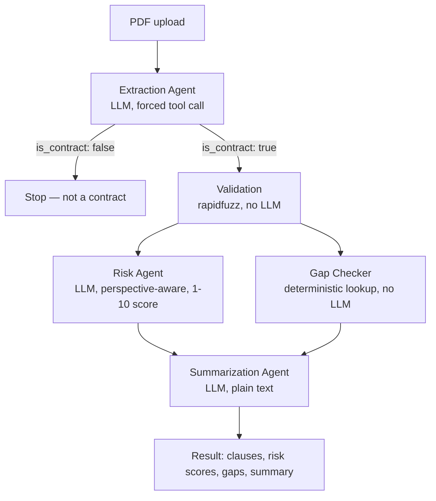

# Contract Intelligence Platform

Upload a contract, get its clauses extracted, risk-flagged from your chosen party's perspective, and summarized in plain English — run through a five-stage agent pipeline: extraction, validation, risk flagging, gap-checking, and summarization.


*(Add a screenshot here — save it as `docs/screenshot.png` in the repo, or update the path above to wherever you put it.)*

**[Live demo](https://contract-intelligence-platform-eauj.onrender.com)** · Built from scratch, no LangChain / LlamaIndex — part of a broader [LLM engineering portfolio](https://github.com/msarkar2501/LLM_Learning)

> Hosted on a free tier — the first request after a period of inactivity can take up to a minute while the server wakes up. Uploads are capped at 5/hour and 10MB. Please use a sample contract, not a real confidential one — text is sent to an AI model for analysis and isn't stored, but this is a portfolio demo, not a compliance tool.

---

## What it does

Upload a contract PDF, and the app:
1. Detects the contract type and every party to the agreement
2. Extracts every clause and classifies it against a 19-type taxonomy
3. Validates that each extracted clause actually appears verbatim in the source text
4. Lets you pick which party you are, then scores every clause's risk from 1–10 *relative to that party* — the same clause can be low risk for one side and high risk for the other
5. Flags clause types that would normally be expected for this contract type but are missing
6. Writes a plain-English summary a non-lawyer can actually use

## Architecture



Four subagents — Extraction, Risk-Flagging, and Summarization are LLM calls; Validation is plain Python. The Gap Checker is a deterministic lookup, not a model call either. Orchestration is split into two phases, `extract_step` then `analyze_step`, specifically so the UI can show detected parties before asking which one the user is — since that answer changes how risk gets scored.

## Design decisions worth noting

- **No RAG.** Full contract text goes straight to the extraction agent. Contracts are short enough that the accuracy cost of chunking/retrieval wasn't worth it here.
- **Structured output only where it matters.** Extraction and risk assessment use forced tool calls so the output is always parseable JSON. Summarization is deliberately left as free-text generation — it's prose, not data, and forcing it into a schema would hurt the writing.
- **Deterministic where possible.** Clause validation (fuzzy-matching extracted text against the source) and the missing-clause gap check are both plain Python, not LLM calls — cheaper, instant, and can't hallucinate a clause into existing when it doesn't.
- **Risk is directional.** A liability clause that's low-risk for the drafting party can be high-risk for the other side. The risk agent is told explicitly which party it's protecting, and scores 1–10 against a calibration rubric rather than a bare "give it a number" — uncalibrated LLM scores otherwise tend to cluster meaninglessly around the middle.

## Tech stack

- **Backend:** FastAPI (Python), Gemini 3.6-flash via Gemini's OpenAI-compatible endpoint
- **Frontend:** Vanilla HTML/CSS/JS — no framework
- **Validation:** rapidfuzz (fuzzy string matching, no LLM)
- **PDF parsing:** pypdf
- **Deployment:** Docker, hosted on Render

## Running it locally

```bash
git clone https://github.com/msarkar2501/Contract-Intelligence-Platform.git
cd Contract-Intelligence-Platform
python -m venv venv
venv\Scripts\Activate.ps1      # Windows PowerShell
# source venv/bin/activate     # macOS/Linux
pip install -r requirements.txt
```

Create a `.env` file in the project root:
```
GEMINI_API_KEY=your_key_here
```

Run the backend:
```bash
uvicorn main:app --reload
```

Then open `index.html` directly in a browser — it points at `http://localhost:8000` by default.

## Running it with Docker

```bash
docker build -t contract-intel-backend .
docker run -p 8000:8000 --env-file .env contract-intel-backend
```

## Known limitations

- No OCR — scanned/image-only PDFs return a clear error rather than silently failing, but they can't currently be read. Deliberately scoped out for v1: OCR accuracy on real scans is uneven, and a bad read fails silently in a way plain text extraction doesn't.
- No formal evaluation harness yet. Next step is benchmarking against the [CUAD dataset](https://www.atticusprojectai.org/cuad) with precision/recall and an LLM-as-judge pass.
- Only lightly tested against real-world contract variety so far — the fuzzy-match validation threshold and token budgets are tuned against a small sample.

## License

MIT — see [LICENSE](LICENSE).

## About

Built by a Mechanical Engineering student, as part of a self-directed LLM/AI engineering portfolio built without a formal CS background, with the help of `Claude.ai`. More of the series — Agentic AI complete learning journey — is at [github.com/msarkar2501/LLM_Learning](https://github.com/msarkar2501/LLM_Learning).
